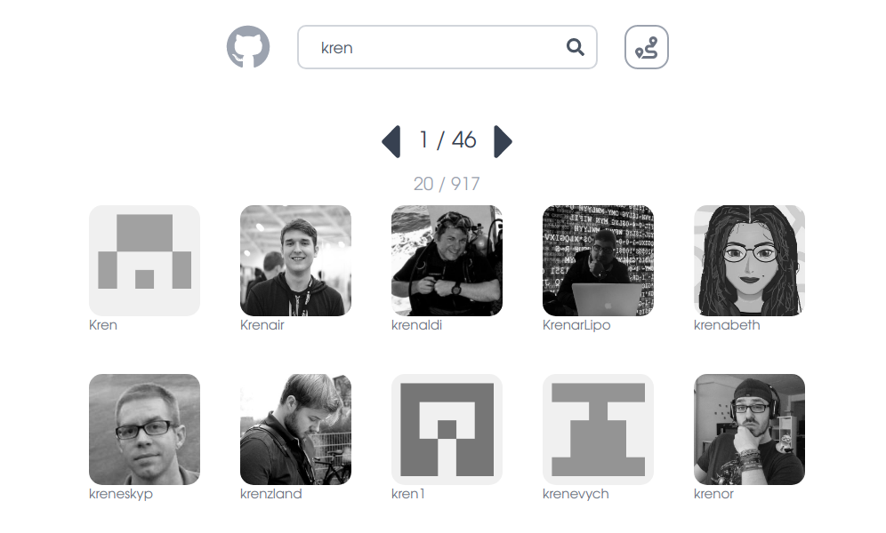
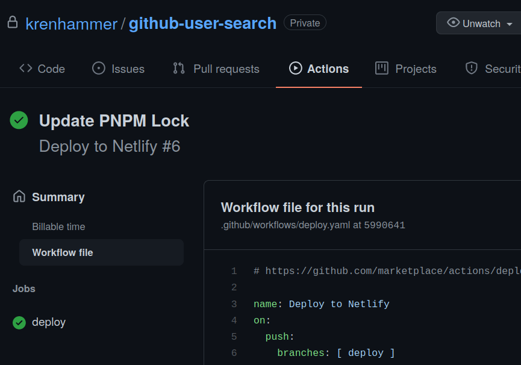
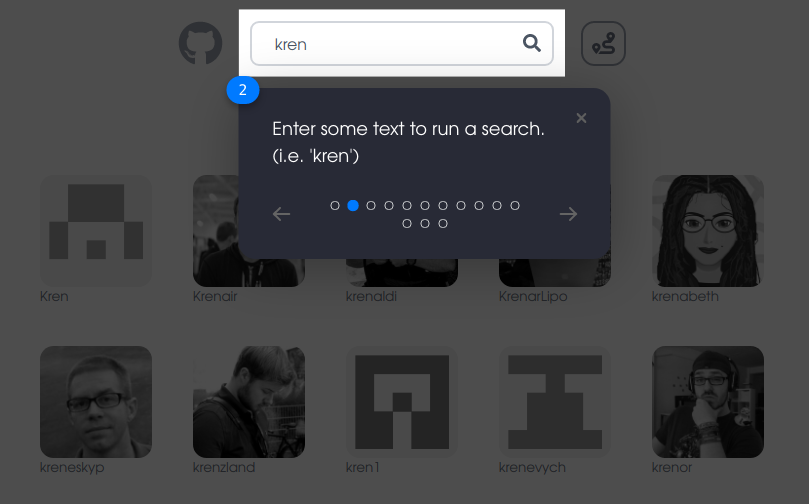
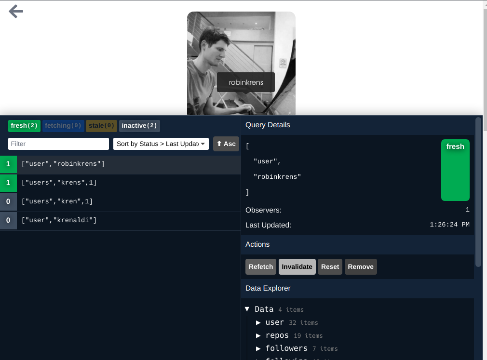
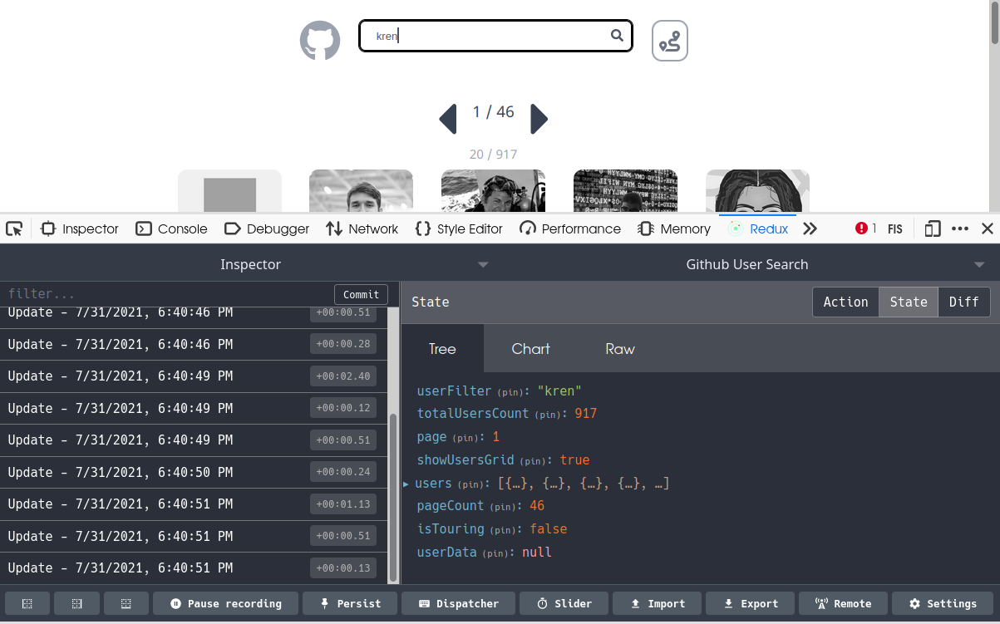
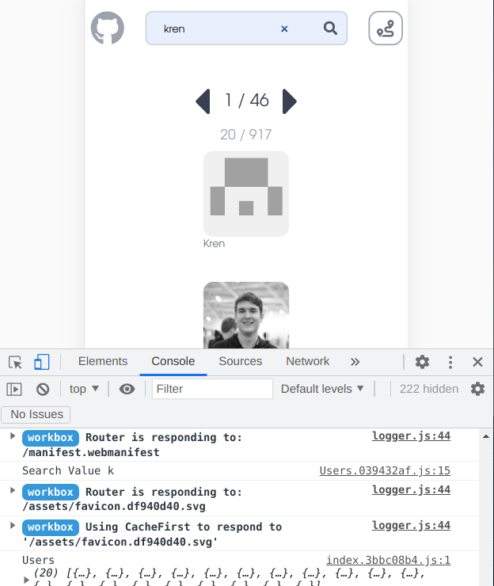

# [Github User Search](https://sk-ghusersearch.netlify.app/)

Is a [TypeScript](https://www.typescriptlang.org/) based [React](https://reactjs.org/) web application used to search the [Github](https://github.com/) userbase.

## Highlights

### Development/Deployment Workflow:
In order to facilitate a clean development/deployment workflow, this app makes use of [three branches](https://github.com/krenhammer/github-user-search/branches):
- `dev` ([Development Codebase](https://github.com/krenhammer/github-user-search/tree/dev))
- `main` ([Tested, Production Ready Codebase](https://github.com/krenhammer/github-user-search/tree/main))
- `deploy` ([Tracking branch for GitOps Deployment to Netlify](https://github.com/krenhammer/github-user-search/tree/deploy))

For convenience, the [scripts](https://github.com/krenhammer/github-user-search/tree/main/scripts) directory contains two scripts to automate merging between the [three branches](https://github.com/krenhammer/github-user-search/branches):
- [`scripts/merge-main.sh`](https://github.com/krenhammer/github-user-search/blob/deploy/scripts/merge-main.sh): Merge `dev` into `main`
- [`scripts/deploy`](https://github.com/krenhammer/github-user-search/blob/deploy/scripts/deploy.sh): Merge `main` into `deploy`

Additionally, both scripts can be run simultaneously using the [`merge-deploy` `package.json`](https://github.com/krenhammer/github-user-search/blob/deploy/package.json#L8) command.

### GitHub Actions Deployment
The app uses [GitHub Actions](https://github.com/krenhammer/github-user-search/actions) to enable a continuous integration workflow for deployment to [Netlify](https://sk-ghusersearch.netlify.app/).

Here is an overview of that process:
- Checkout code from this [repo](https://github.com/krenhammer/github-user-search).
- Install dependencies using `pnpm install`.
- Build the project with `pnpm run build`.
- Deploy to Netlify using the [`South-Paw/action-netlify-deploy` GitHub Action](https://github.com/South-Paw/action-netlify-deploy)

### Feature / Onboarding Tour
Clicking the **Tour Button** (see below), starts a **Feature Tour**

### API Request Caching
Facilitated through the use of [React Query](https://react-query.tanstack.com/)

Cache and Stale times are adjusted in the [`useUser.ts`](https://github.com/krenhammer/github-user-search/blob/main/src/hooks/useUser.ts) and [`useUsersSearch.ts`](https://github.com/krenhammer/github-user-search/blob/main/src/hooks/useUsersSearch.ts) custom hooks. See below for more info.

HINT: Click the [React Query Dev Tools](https://react-query.tanstack.com/devtools) button in the lower left corner to open the inspector.

### Application Wide State Management
The application utilizes [Valtio](https://github.com/pmndrs/valtio)'s change aware proxy state. In addition, [Valtio](https://github.com/pmndrs/valtio) supports the use of the standard [Redux Dev Tools](https://github.com/reduxjs/redux-devtools) browser extension to provide a formidable state inspection toolset. See [`state`](https://github.com/krenhammer/github-user-search/blob/main/src/state/index.ts) folder contents for more details.

### Custom Hooks
Can be found in the [Hooks directory](https://github.com/krenhammer/github-user-search/tree/main/src/hooks).

- [`useStoredQueryData.ts`](https://github.com/krenhammer/github-user-search/blob/main/src/hooks/useStoredQueryData.ts) - Hydrates [`valtio`](https://github.com/pmndrs/valtio) state with data from query hooks.
- [`useURLState.ts`](https://github.com/krenhammer/github-user-search/blob/main/src/hooks/useURLState.ts) -
  Store and retrieve URL parameters to state.
- [`useUser.ts`](https://github.com/krenhammer/github-user-search/blob/main/src/hooks/useUser.ts) - 
  Query hook to fetch user data from GitHub given a `username`.
- [`useUsersSearch.ts`](https://github.com/krenhammer/github-user-search/blob/main/src/hooks/useUsersSearch.ts) - Query hook to search GitHub Users given a `userFilter` search string.

### Chunk Splitting / Federated Lazy Loading
<!-- https://segmentfault.com/a/1190000039875183/en -->
<!-- https://loadable-components.com/ -->

App uses [`@loadable/component`](https://loadable-components.com/) to lazy load React Components for given routes. This enables [Vite Chunk Splitting](https://vitejs.dev/guide/features.html#async-chunk-loading-optimization) / [Brotli Compression](https://github.com/google/brotli) and reduces the bundle size. See [`main.tsx`](https://github.com/krenhammer/github-user-search/blob/main/src/main.tsx)

### Browser Experience Optimization
Application has been tuned using [Chrome Lighthouse](https://developers.google.com/web/tools/lighthouse/) to provide an optimal browser experience. 

### Accessibility
Application leverages [React Aria](https://react-spectrum.adobe.com/react-aria/index.html) to ensure high-standard accessibility for the user interface.

### Responsive Layout / PWA Functionality
By utilizing [TailwindCSS'](https://tailwindcss.com/) [Mobile First breakpoints](https://tailwindcss.com/docs/responsive-design#mobile-first) and the [Vite PWA Plugin](https://github.com/antfu/vite-plugin-pwa), the application is able to support a robust Mobile experience. See [`vite.config.ts`](https://github.com/krenhammer/github-user-search/blob/main/vite.config.ts) for more details.

Service Worker tasking can be viewed below:

