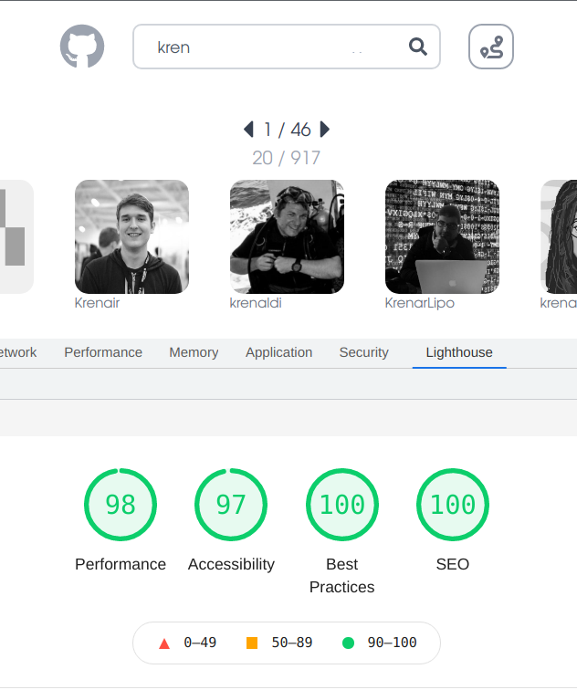

# [Github User Search](https://sk-ghusersearch.netlify.app/)

Is a [TypeScript](https://www.typescriptlang.org/) based [React](https://reactjs.org/) web application used to search the [Github](https://github.com/) userbase.

## Highlights

### Development/Deployment Workflow:
In order to facilitate a clean development/deployment workflow, this app makes use of [three branches](https://github.com/krenhammer/github-user-search/branches):
- `dev` ([Development Codebase](https://github.com/krenhammer/github-user-search/tree/dev))
- `main` ([Tested, Production Ready Codebase](https://github.com/krenhammer/github-user-search/tree/main))
- `deploy` ([Tracking branch for GitOps Deployment to Netlify](https://github.com/krenhammer/github-user-search/tree/deploy))

For convenience, the [scripts](https://github.com/krenhammer/github-user-search/tree/main/scripts) directory contains two scripts to automate merging between the [three branches](https://github.com/krenhammer/github-user-search/branches):
- [`scripts/merge-main.sh`](https://github.com/krenhammer/github-user-search/blob/deploy/scripts/merge-main.sh): Merge `dev` into `main`
- [`scripts/deploy`](https://github.com/krenhammer/github-user-search/blob/deploy/scripts/deploy.sh): Merge `main` into `deploy`

Additionally, both scripts can be run simultaneously using the [`merge-deploy` `package.json`](https://github.com/krenhammer/github-user-search/blob/deploy/package.json#L8) command.

### GitHub Actions Deployment
The app uses GitHub Actions to enable a continuous integration workflow for deployment to [Netlify](https://sk-ghusersearch.netlify.app/).

Here is an overview of that process:
- Checkout code from repo.
- Install dependencies using `pnpm install`.
- Build the project with `pnpm run build`.
- Deploy to Netlify using the [`South-Paw/action-netlify-deploy` GitHub Action](https://github.com/South-Paw/action-netlify-deploy)

### Feature / Onboarding Tour

Clicking the Tour Button Starts a Feature Tour

### API Request Caching
Facilitated through the use of [React Query](https://react-query.tanstack.com/)

Cache and Stale times are adjusted in the [`useUser.ts`](https://github.com/krenhammer/github-user-search/blob/main/src/hooks/useUser.ts) and [`useUsersSearch.ts`](https://github.com/krenhammer/github-user-search/blob/main/src/hooks/useUsersSearch.ts) custom hooks. See below for more info.

HINT: Click the [React Query Dev Tools](https://react-query.tanstack.com/devtools) button in the lower left corner to open the inspector.

### Custom Hooks
Can be found in the [Hooks directory](https://github.com/krenhammer/github-user-search/tree/main/src/hooks).
They duties are respectively:

- [`useStoredQueryData.ts`](https://github.com/krenhammer/github-user-search/blob/main/src/hooks/useStoredQueryData.ts) - Hydrates [`valtio`](https://github.com/pmndrs/valtio) state with data from query hooks.
- [`useURLState.ts`](https://github.com/krenhammer/github-user-search/blob/main/src/hooks/useURLState.ts) -
  Store and retrieve URL parameters to state.
- [`useUser.ts`](https://github.com/krenhammer/github-user-search/blob/main/src/hooks/useUser.ts) - 
  Query hook to fetch user data from GitHub given a `username`.
- [`useUsersSearch.ts`](https://github.com/krenhammer/github-user-search/blob/main/src/hooks/useUsersSearch.ts) - Query hook to search GitHub Users given a `userFilter` search string.

### Browser Experience Optimization
Application has been tuned using [Chrome Lighthouse](https://developers.google.com/web/tools/lighthouse/) to provide an optimal browser experience. 

### Accessibility
Application leverages [React Aria](https://react-spectrum.adobe.com/react-aria/index.html) to ensure high-standard accessibility for the user interface.

